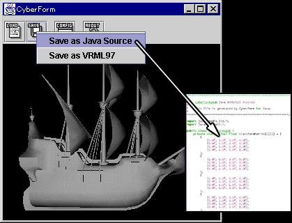
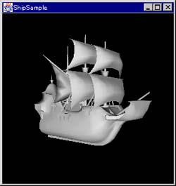

# CyberForm for Java3D

CyberForm for Java3D is a source code generator for Java3D programmers. CyberForm generates a compressed binary file that has a specified
geometry information with the source code. To specify the output precision, you can reduce the file size more. Using CyberForm, you can generate small and appropriate geometry files for Java3D applications on the Internet.

Currently, CyberForm can load some geometry file formats, VRML97, Autodesk 3DS, Wavefront OBJ, LightWave3D LWS and SENSE8 NFF, and generate the source code. Using CyberForm, you can add the generated source code to your programs very easily, and create the your programs more simply and small because you don't have to use big loader packages to load the geometry information.

You can use CyberForm as a VRML97 translator utility because CyberForm can save the shape information into a VRML97 file too.

I am developing CyberForm with CyberVRML97ForJava that is development package for Java3D and VRML97. If you have any interest in VRML97 or
Java3D application developments, yon can get the information in more detail from the package package.

Please chceck [the download site](https://sourceforge.net/projects/cfj3d/files/) on SourceForge.net to get the package and the samples.

## Repository

- [User's Guide v1.1 (English)](doc/cfj3d110usersguide.pdf)
- [User's Guide v1.1 (Japanese)](doc/cfj3d110usersguidej.pdf) 

## Samples

### galleon.obj

This original file size is 281KB. CyberForm reduces the file size into 51KB using the following options.

Parameter | Value
---|---
Coordinate Precision | 16 bit
Normal Precision | 8 bit
Color Format | 16 bit (RGBA)
Texture Format | None
TexCoord Precision | 8 bit
